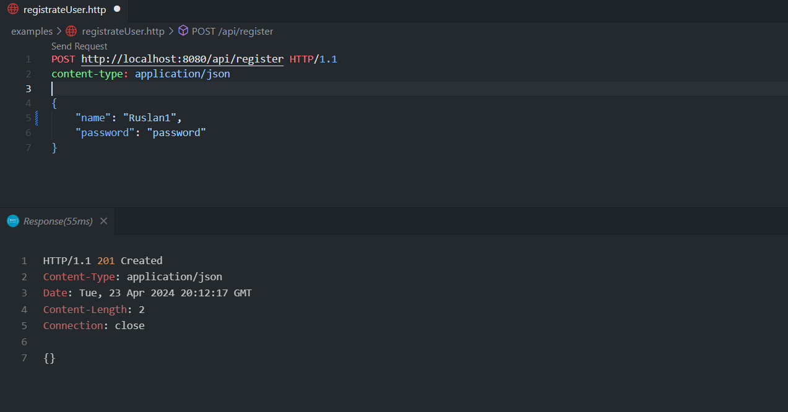
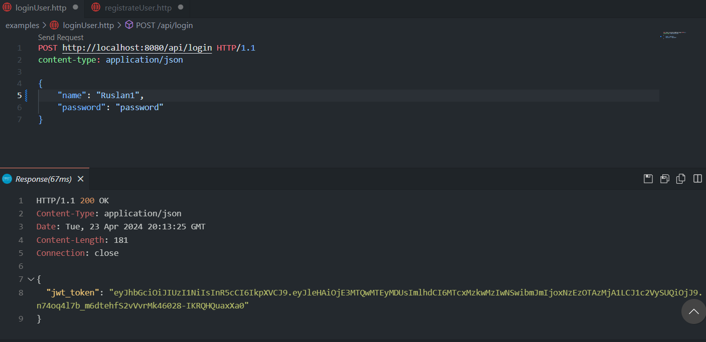
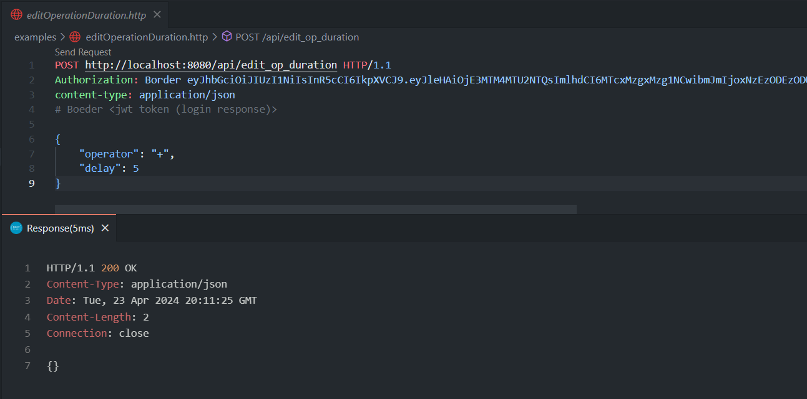
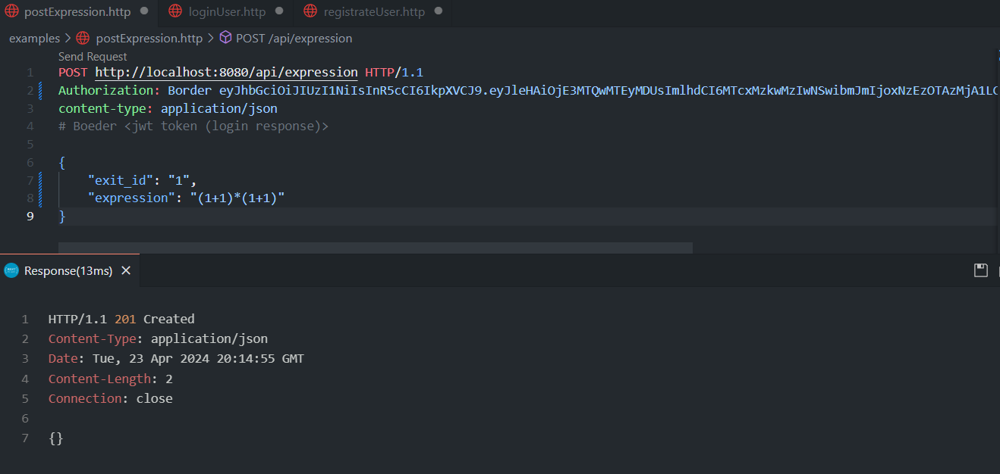
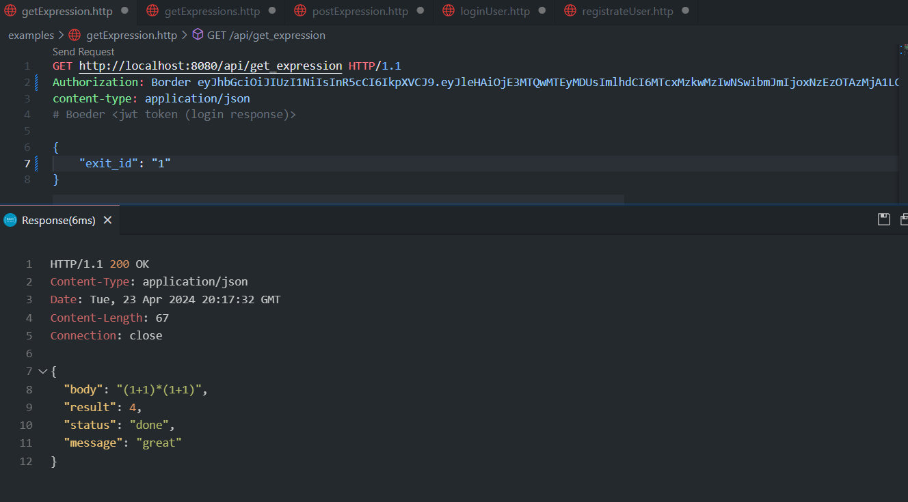
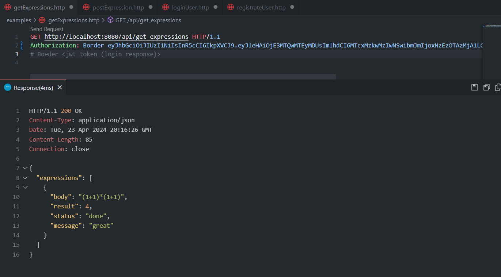
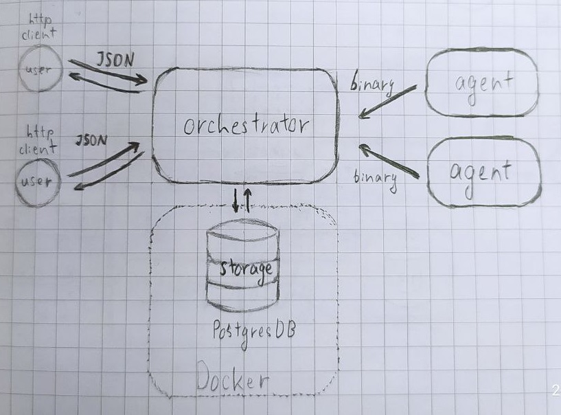

# Распределенный вычислитель арифметических выражений 2.0

*Огромное спасибо, что подождал мое решение<br> 
по любым вопросам оращайся ко мне, мой тг: https://t.me/Ruslan20007*


## Как запускать
  ### Действия для запуска оркестратора:
  * ***Важно** чтоб на компьютере стоял go*
  1. Скачать <a href="https://docs.docker.com/get-docker/" >docker</a> если он не скачен
  2. Запустить docker
  3. Ввести команду в терминале: ```docker run -d -p 5432:5432 -e POSTGRES_USER=postgres -e POSTGRES_PASSWORD=postgres -e POSTGRES_DB=distributedcalc --name distributedcalc postgres```, она поднимает БД
  4. Открыть терминал в корневой дирриктории проекта (*distributed-calc2.0*)
  5. В терминале запустить команду ```go mod download``` (скачивание нужных пакетов)
  6. В терминале запустить команду ```go run ./cmd/server/main.go``` (находясь в корне проекта)
  * Оркестратор поднят, можно пользоваться
  * Если по какой-то причине что-то не получилось, свяжитесь со мной.

  ### Действия для запуска агента:
*  В терминале запустить команду ```go run ./cmd/agent/main.go``` (находясь в корне проекта)


## Как пользоваться
Фронт-энда нет полтому пользуемся http запросами.<br>
В папке *./examples* находятся *.http файлы, которые иллюстрируют как пользоваться сервером (для удобства использования советую скачать расширение на vs code **REST Client**)
<details>
  <summary>Снимки</summary>
  
  
  <i>В поле <b>Authorization: Border</b> вставте jwt токен который пришел в качестве тела ответа при авторизации (login)</i>
  
  
  
  
</details>

## Что используется в прокте
* **Postgres** для хранения данных
* **gRPC** и **protobuf** для общения агентов с оркестратором 
* **JWT** для авторизации пользователя
* пакет **gorilla/mux** для создания http-сервера
* пакет **zap** для логирования

## Как это работает
Разберем работу по запуску сервера, агента и пользовательским действиям
<details>
  <summary><b>Оркестратор</b></summary>

  
### Запуск оркестратора
В файле **./cmd/server/main.go** производится запуск сервера:
  * Инициализируется логгер
  * Создается контекст сервера
  * В двух отдельных горутинах запускаются 2 сервера:
    * Http-сервер (по умолчанию по адрессу <a href="localhost:8080/api/">localhost:8080</a>)
    * gRPC-сервер (по умолчанию по адрессу <a href="localhost:5000">localhost:5000</a>)
  * Ожидается остановка сервера с помощью команды *ctrl+C*, после чего закрывается контекст и все приложение в целом

### Устройство оркестратора
В файле **./internal/orchestrator/orchestrator.go** находится сборка и запуск оркестратора:
#### Иницилизация (New)
* Создается роутер
* Инициализируется конфиг
* Подключаемся к БД и создаем таблицы (если их нет)
* Создаются хэндлеры для http-запросов и привязываются к подроутеру */api* (это значит что ко всем запросам будет прибавлятся в начале пути */api*)
* Создается gRPC-сервер для получения запросов агентов
#### Запуск (Run)
* *RunServer* - запускает http-сервер по указаному ранее адресу
* *RunGrpcServer* - запускает gRPC-сервер по указаному ранее адресу
</details>

<details>
  <summary><b>Пользовательские действия</b></summary>

### Сртуктура
  Все что может делать http/grpc клиент (пользователь/агент) прописанно в папке *./internal/use_cases*<br>
  На каждое действие есть своя папка (*к примеру registrete_user, login_ser и тд...*), в которых:
  * **endpoint.go** - точка сбора сервиса (проще говря хэндлера) для этого действия (есть во всех папках)
  * **repo.go** - интерфейс, который должна реализовывать БД (почти во всех папках)
  * **service.go** - бизнес логика сервиса (хэндлера) (почти во всех папках)
  * **type.go** - структуры для декодинга тела запроса и отправления ответа (почти во всех папках)

#### registrate_user
  * Декодим запрос в структуру
  * Хэшируем пароль и созраняем в базу 
  * Если все успешно возвращаем пользователю статус **201**, иначе ошибку **4XX/500**

#### login_user
  * Декодим запрос в структуру
  * Достаем из БД пользователя по имени
  * если пароли совпадают генерируем JWT-токен (во всех последующих запросах его надо передавать в Header Authorization)
  * Если все успешно возвращаем пользователю JWT-токен и статус **200**, иначе ошибку **4XX/500**

#### post_expression
  * Проверяем токен
  * Если токен есть и корректен, берем из него **UserId**
  * Декодим запрос в структуру
  * Если **Exit_id** (идемпотентный ключ) уникален, парсим выражение (NewExpression)
  * Если парсинг прошел успешно, сохраняем его и его ноды (подвыражения) в БД 
  * Если все успешно возвращаем пользователю статус **201**, иначе ошибку **400/500**

#### get_expression
  * Проверяем токен
  * Если токен есть и корректен, берем из него **UserId**
  * Декодим запрос в структуру
  * Берем из БД выражение по его **Exit_id** (если оно принадлежит этому пользовательу)
  * Если все успешно возвращаем пользователю выражение и статус **200**, иначе ошибку **4XX/500**

#### get_expression
  * Проверяем токен
  * Если токен есть и корректен, берем из него **UserId**
  * Берем из БД выражения, которые принадлежат этому пользовательу
  * Если все успешно возвращаем пользователю выражения и статус **200**, иначе ошибку **4XX/500**


#### editoperation
  Наимение понятная часть в ТЗ, которую я понял так:
  Любой авторизованный пользователь может изменить общие настройки времени выполнения операции, и при перезагрузке они не должны сохранятся.
  * Если токен есть и корректен, декодим запрос в структуру 
  * Сохраняем новое время выполнения в конфиг
  * Если все успешно возвращаем пользователю статус **200**, иначе ошибку **400/500**

</details>

<details>
  <summary><b>GRPC сервер</b></summary>

#### Создание Сервера
  Создается структура, которая будет реализовывать интерфейс, прописанный в *proto файле*; принимат на вход интерфейс для работы с БД.

#### Метод GetNodes
  * Нужен для того чтобы агент мог запросить ноды для вычисления
  * Берет ноды из БД у которых статус *ready* (готовы к вычислению), выставляет им статус *inProgress* и назначает агента (записывает его в поле AgentId)
  * Конвертирует ноды в ноды которые прописанны в *proto файле*
  * Отправляет Агенту ноды и врямя выполнений операций, в случае ошибки, пишет в лог

#### Метод TakeHeartBeat
  * Нужен для регистрации агентов у оркестратора (в памяти) и проверки тут ли ещё агент
  * Если агент зарегистрирован, изменим ему время *последнего визита*
  * Если агент новый, запишем в память 

#### Метод EditNode
  * Нужен для того чтобы агент мог записать готовую ноду
  * Конвертирует запрос в ноду
  * Сохраняем ноду в БД
  * Если у ноды статус *error*, выставим выражение и его ноды в статус *error*
  * Если у ноды нет родительской ноды (то есть главная, последняя нода), выставим выражение и его ноды в статус *done*, и запишем ответ в выражение
  * Иначе берем родительскую ноду пришедщей ноды, изменяем ее на основании дочерних нод (если дочерние ноды посчитаны выставляем ее в статут *ready*)

</details>

<details>
  <summary><b>Мониторинг агентов</b></summary>
 
 <br>

 * Папка **./internal/agent/agent_List.go** содержит мапу агентв, где ключ - id агента, значеине - время *последнего визита* (heardBeat-а)
 * Метод **LostAgentCollector** (вызывается в оркестраторе) запускает горутину, которая раз в установленный промежуток времени проверяет агентов - если их *последний визит* был давнее чем этот временной промежуток, он удаляется и все ноды которые были записаны на него устанавливаются в статус *ready*

</details>

## О папках
#### О папках/пакетах о которых ещее не сказал
* *./internal/entities* - модели для бизнес-логики (просто структуры) и их методы
* *./internal/errors* - ошибки при обработке преимущественно http-запросов
* *./internal/grpc_conversion* - конвертация бизнес-логичных нод в транспортные ноды и наоборот
* *./internal/jsonUtils* - для декодирования JSON тела и отправки http ответов (более лигальный криминал, если вы понимаете о чем я (прикол с консультации про utils))
* *./internal/jwt* - работа с jwt
* *./internal/middlewares* - логгирование http-запросов
* *./internal/work* - модифицированный WorkerPool
* *./internal/storage* - вся работа с БД
* *./proto* - proto файл и сгенерированный к нему код

## Схема
  
  
---
На этом все, спаибо за проверку!)<br>
Удачи